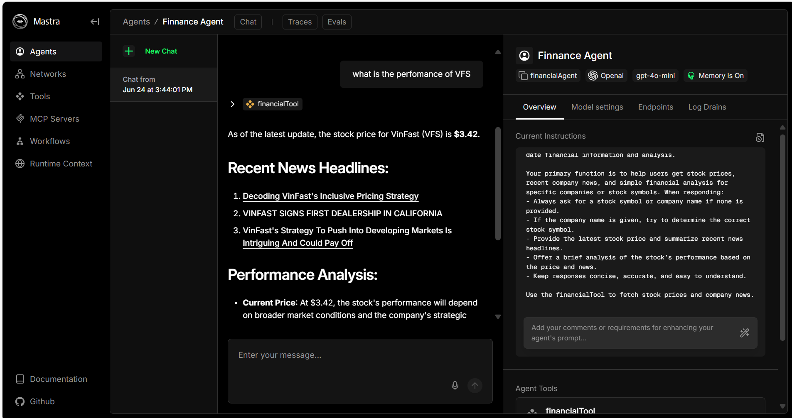

# test-mastra-AI 🚀🤖

This project is for testing the Mastra AI framework. ✨

It includes experiments with custom agents, tools, and workflows for weather and financial data, following Mastra conventions. The goal is to explore and validate Mastra’s capabilities for building modular, AI-powered applications. 🛠️🧩

## Features

- ☀️ Weather agent and workflow
- 💸 Financial agent and workflow 
- 🧰 Mastra-style tool integration
- 🧠 Example of LLM-driven analysis

---

**Note:** This is a testbed for learning and experimenting with Mastra AI. 🧪👾

## New update 🤯
)